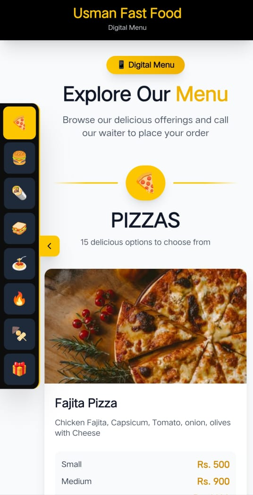
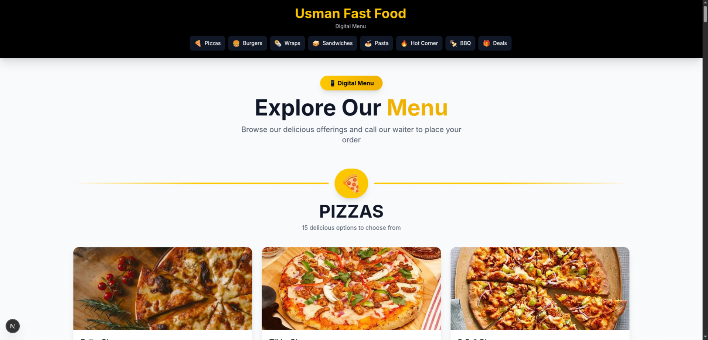

# 🍕 Usman Fast Food - Digital Menu

A modern, responsive digital menu application built with Next.js 16, TypeScript, and Tailwind CSS. Perfect for restaurants looking to provide an interactive and user-friendly menu browsing experience.

## ✨ Features

### 🎯 Core Functionality
- **Digital Menu Display** - Browse complete restaurant menu with categories
- **Responsive Design** - Perfect viewing experience on all devices (mobile, tablet, desktop)
- **Floating Sidebar Navigation** - Quick category navigation on mobile/tablet
- **Sticky Header** - Desktop navigation always accessible
- **Smooth Scrolling** - Seamless navigation between menu sections
- **Scroll to Top** - Quick return to top with animated button

### 📱 Mobile Features
- **Collapsible Sidebar** - Space-saving floating sidebar with toggle
- **Touch-Optimized** - Large, easy-to-tap buttons
- **Active Section Highlighting** - Visual indicator of current menu section
- **Tooltips** - Category names on hover/long-press

### 🖥️ Desktop Features
- **Full Header Navigation** - Category buttons in header
- **Optimized Layout** - Maximum content visibility
- **Hover Effects** - Interactive elements with smooth transitions

### 🎨 Design Features
- **Modern UI** - Clean, contemporary design with yellow accent color
- **Dark Theme Elements** - High contrast, easy-to-read interface
- **Gradient Backgrounds** - Subtle visual appeal
- **Icon Integration** - Emoji-based category icons
- **Professional Typography** - Clear, readable fonts

## 📋 Menu Categories

The digital menu includes the following categories:
- 🍕 **Pizzas** - Various pizza options
- 🍔 **Burgers** - Burger selection
- 🌯 **Wraps** - Wrap varieties
- 🥪 **Sandwiches** - Sandwich choices
- 🍝 **Pasta** - Pasta dishes
- 🔥 **Hot Corner** - Spicy items
- 🍢 **BBQ** - BBQ specialties
- 🎁 **Deals** - Special offers and combos

## 🚀 Getting Started

### Prerequisites

Make sure you have the following installed:
- Node.js 18.x or higher
- npm or yarn package manager

### Installation

1. **Clone the repository**
```bash
git clone https://github.com/usman-fast-food/usman-fastfood-menu.git
cd usman-fastfood-menu
```

2. **Install dependencies**
```bash
npm install
# or
yarn install
```

3. **Run the development server**
```bash
npm run dev
# or
yarn dev
```

4. **Open in browser**
```
http://localhost:3000
```

### Build for Production

```bash
npm run build
npm start
# or
yarn build
yarn start
```

## 📁 Project Structure

```
usman-fast-food/
├── app/
│   ├── layout.tsx          # Root layout with metadata
│   ├── page.tsx            # Main page component
│   └── globals.css         # Global styles
├── components/
│   ├── Header.tsx          # Header with navigation
│   ├── Footer.tsx          # Footer component
│   ├── FloatingSidebar.tsx # Mobile sidebar navigation
│   └── MenuCategory.tsx    # Menu category display
├── data/
│   └── menu.ts             # Menu data structure
├── public/
│   ├── favicon.ico         # Browser favicon
│   └── apple-touch-icon.png # Mobile icon
├── README.md
├── package.json
├── tsconfig.json
└── tailwind.config.ts
```

## 🛠️ Technology Stack

### Core Technologies
- **Next.js 16** - React framework with App Router
- **TypeScript** - Type-safe development
- **Tailwind CSS** - Utility-first CSS framework
- **Lucide React** - Beautiful icon library

### Key Features Used
- Server Components & Client Components
- TypeScript interfaces for type safety
- Responsive design with Tailwind breakpoints
- Custom hooks for scroll detection
- State management with React hooks

## 📱 Responsive Breakpoints

The application uses the following Tailwind breakpoints:

- **Mobile**: < 768px (Floating sidebar visible)
- **Tablet**: 768px - 1024px (Floating sidebar visible)
- **Desktop**: ≥ 1024px (Header navigation visible)

## 🎨 Customization

### Changing Brand Colors

Edit `tailwind.config.ts`:
```typescript
theme: {
  extend: {
    colors: {
      primary: '#FACC15', // Yellow-400
      secondary: '#000000', // Black
    }
  }
}
```

### Adding Menu Items

Edit `data/menu.ts`:
```typescript
export const menuData = [
  {
    id: 'category-id',
    name: 'Category Name',
    icon: '🍕',
    items: [
      {
        id: 'item-id',
        name: 'Item Name',
        description: 'Item description',
        price: 'Rs. 000',
        image: '/path/to/image.jpg' // optional
      }
    ]
  }
];
```

### Modifying Restaurant Name

Edit `components/Header.tsx` and `app/layout.tsx`:
```typescript
// Header.tsx
<h1>Your Restaurant Name</h1>

// layout.tsx
export const metadata: Metadata = {
  title: "Your Restaurant - Digital Menu",
  description: "Your description",
};
```

## 🔧 Configuration

### Environment Variables

Create a `.env.local` file:
```env
NEXT_PUBLIC_RESTAURANT_NAME="Usman Fast Food"
NEXT_PUBLIC_CONTACT_NUMBER="+92-XXX-XXXXXXX"
```

### Metadata Configuration

Update `app/layout.tsx`:
```typescript
export const metadata: Metadata = {
  title: "Restaurant Name - Digital Menu",
  description: "Your menu description",
  icons: {
    icon: "/favicon.ico",
    apple: "/apple-touch-icon.png",
  },
};
```

## 📸 Screenshots

### Mobile View



- Floating sidebar with category icons
- Toggle button for show/hide
- Smooth scrolling navigation
- Responsive menu items

### Desktop View



- Full header with navigation buttons
- Wide layout for better content display
- Hover effects on interactive elements

## 🚀 Deployment

### Deploy on Vercel (Recommended)

1. Push your code to GitHub
2. Import project# usman-fastfood-menu
